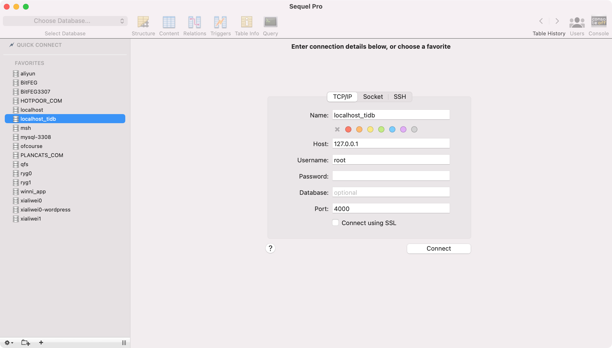
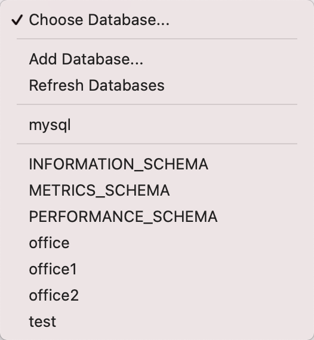

# FindMaster_Office_for_TiDB
FindMaster_Office_for_TiDB, TiDB Hackathon 2022 - HOTPOOR team‘s RFC

### STEP-1 配置TiDB
```
curl --proto '=https' --tlsv1.2 -sSf https://tiup-mirrors.pingcap.com/install.sh | sh

source /Users/xialiwei/.bash_profile

tiup playground

tiup --tag office playground
```
### STEP-2 客户端登录



### STEP-3 配置database和表

office、office1、office2



```
# office

CREATE TABLE `index_login` (
  `login` varchar(255) NOT NULL DEFAULT '',
  `entity_id` char(32) NOT NULL DEFAULT '',
  `search` varchar(255) DEFAULT '',
  `id` int(11) unsigned NOT NULL AUTO_INCREMENT,
  `app` varchar(255) DEFAULT NULL,
  `about` varchar(32) DEFAULT NULL,
  PRIMARY KEY (`id`),
  UNIQUE KEY `entity_id` (`entity_id`),
  UNIQUE KEY `login` (`login`)
) ENGINE=InnoDB AUTO_INCREMENT=0 DEFAULT CHARSET=utf8mb4;

CREATE TABLE `index_qrcodepackages` (
  `id` int(11) unsigned NOT NULL AUTO_INCREMENT,
  `about` varchar(255) DEFAULT NULL,
  `block_id` char(32) DEFAULT NULL,
  `user_id` char(32) DEFAULT NULL,
  `amount` int(11) DEFAULT NULL,
  `amountcreated` int(11) DEFAULT NULL,
  `amountused` int(11) DEFAULT NULL,
  `status` varchar(255) DEFAULT NULL,
  `createtime` varchar(255) DEFAULT NULL,
  `updatetime` varchar(255) DEFAULT NULL,
  `finishtime` varchar(255) DEFAULT NULL,
  PRIMARY KEY (`id`)
) ENGINE=InnoDB DEFAULT CHARSET=utf8mb4;

CREATE TABLE `index_search` (
  `word` varchar(255) DEFAULT '',
  `entity_id` char(32) NOT NULL DEFAULT '',
  `entity_ids` mediumblob,
  `search` varchar(255) DEFAULT '',
  `id` int(10) unsigned NOT NULL AUTO_INCREMENT,
  `about` varchar(32) DEFAULT NULL,
  PRIMARY KEY (`id`),
  UNIQUE KEY `entity_id` (`entity_id`)
) ENGINE=InnoDB AUTO_INCREMENT=0 DEFAULT CHARSET=utf8mb4;

# office1

CREATE TABLE `entities` (
  `id` char(32) NOT NULL DEFAULT '',
  `updated` timestamp NOT NULL DEFAULT CURRENT_TIMESTAMP ON UPDATE CURRENT_TIMESTAMP,
  `body` longblob NOT NULL,
  `auto_increment` int(11) NOT NULL AUTO_INCREMENT COMMENT 'basicly never used',
  PRIMARY KEY (`auto_increment`),
  UNIQUE KEY `id` (`id`),
  KEY `updated` (`updated`)
) ENGINE=InnoDB AUTO_INCREMENT=0 DEFAULT CHARSET=utf8mb4;

# office2

CREATE TABLE `entities` (
  `id` char(32) NOT NULL DEFAULT '',
  `updated` timestamp NOT NULL DEFAULT CURRENT_TIMESTAMP ON UPDATE CURRENT_TIMESTAMP,
  `body` longblob NOT NULL,
  `auto_increment` int(11) NOT NULL AUTO_INCREMENT COMMENT 'basicly never used',
  PRIMARY KEY (`auto_increment`),
  UNIQUE KEY `id` (`id`),
  KEY `updated` (`updated`)
) ENGINE=InnoDB AUTO_INCREMENT=0 DEFAULT CHARSET=utf8mb4;
```

### STEP-4 移植FindMaster

```
# 添加findmaster api list

# 替换原有mysql为tidb

# 添加搜索功能

```


